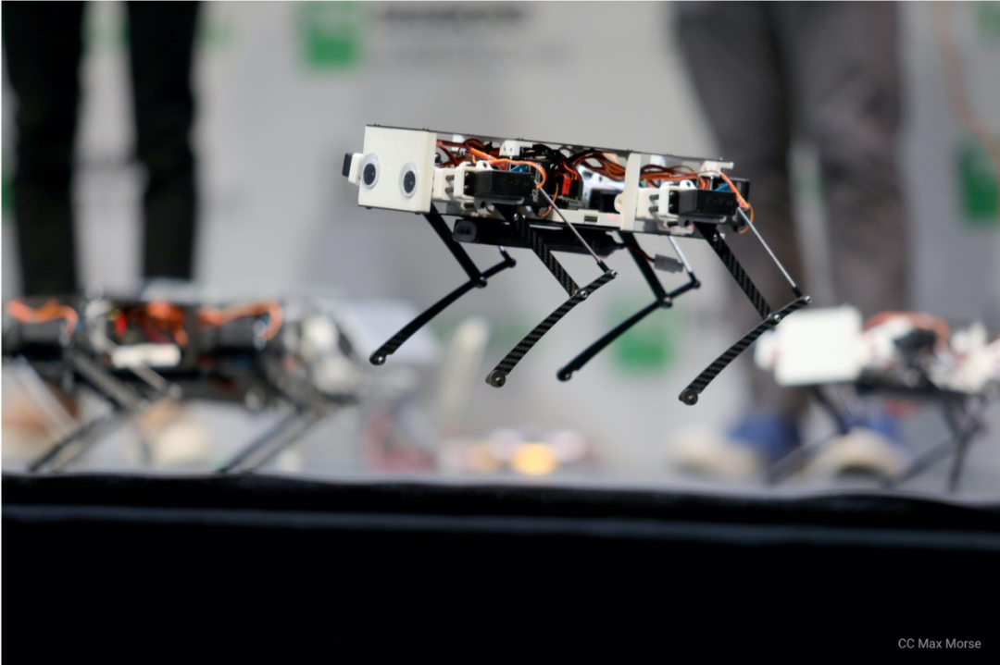
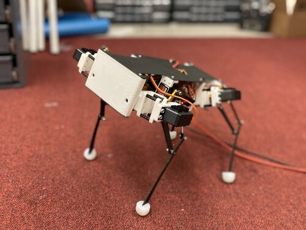
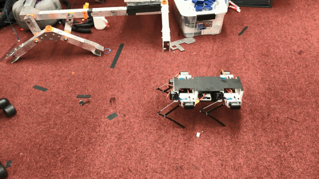
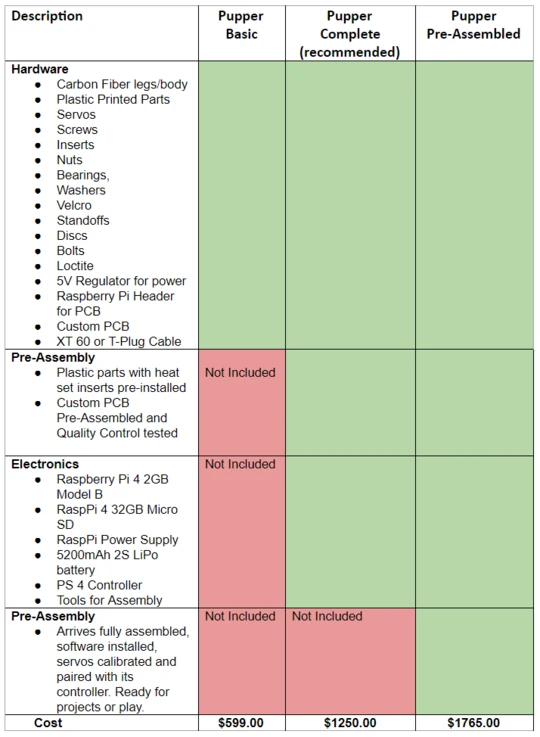
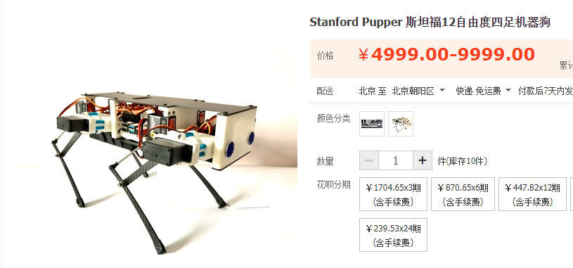
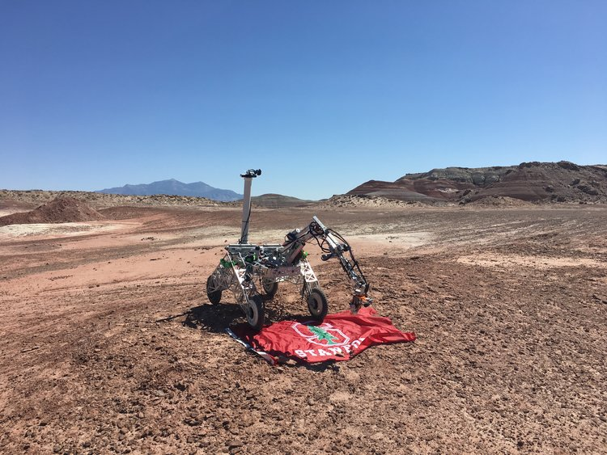
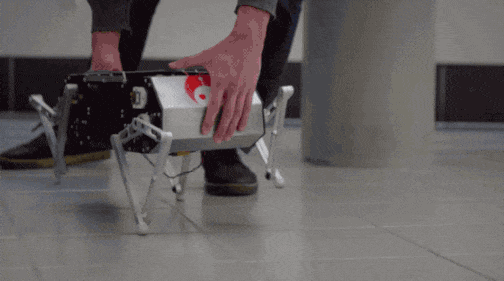
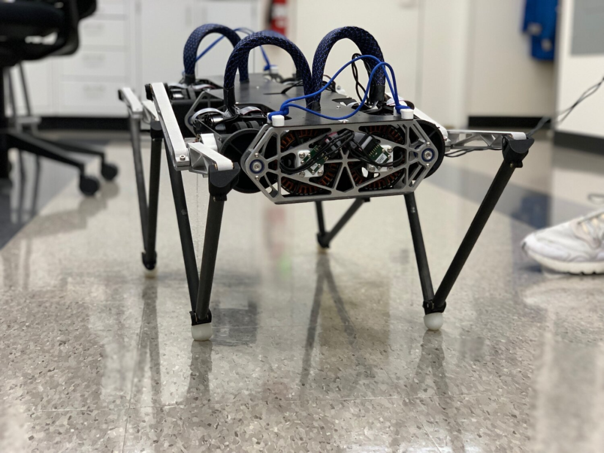

# DIY一只机器狗需要多少钱？最低仅900美元，斯坦福大学出品，代码已开源"

DIY 一只四足机器狗，最低只需要 900 美元？它是斯坦福学生机器人俱乐部的新成员「Pupper」。

自从波士顿动力 Spot 机器狗开启零售以来，不知道有多少人迷上了这只价值 53 万元人民币的昂贵宠物。当然，除了少数大佬以外，人们碍于经济实力，也只能远远观望一下……

现在，我们能够以一个更完美的价格，自己 DIY 四足机器狗了。最近，斯坦福学生机器人俱乐部迎来了家族新成员「Pupper」，零件成本最低仅需 900 美元。

Pupper 可以做到跳跃、小跑、遛弯，用户使用游戏手柄控制它的移动方式和目的地。Pupper 内部的树莓派接受到指令后，将控制伺服电机的运动，以正确的方式行进到正确的地点。

小步快跑，像极了遛狗时的样子。

跳跃动作也十分轻盈。

去年，我们介绍过 Pupper 的兄长 Doggo，也是一款极具运动天赋的机器狗，组装成本在 3000 美元左右。

相比之下，Pupper 的价格更加亲民，设计也更加简单。即使是高中生，也可以 DIY 出自己感兴趣的四足机器人。

在一次采访中，团队成员 Nathan Kau 提到，这只机器狗重量约为 1.2 公斤，看起来「像一个鞋盒」。这只狗会在客厅里走来走去，像一只真正的宠物狗那样。

Pupper 被设置为可编程模式，购买者还能结合自身意愿更改或扩展机器人的功能，包括蹦跳、奔跑等不同步态，或者是叼东西、追着人走这类高级行为。在操作真实的 Pupper 之前，**你也可以在 PyBullet 中模拟它的运动。**

Pupper 的代码已经全部开源，设计文件也可以免费获取。

项目地址：<https://github.com/stanfordroboticsclub/StanfordQuadruped>

CAD 文件：<https://a360.co/2TEh4gQ>

#### 成本最低仅 900 美元

在你资金到位的前提下，要如何才能拥有这款机器狗？

首先需要采购一些零件，如果你已经有了**树莓派**，那么成本中还可以减去这一项。

#### 物料采购

组装 Pupper 所需要的零件，可以直接从 Amazon 或 McMaster-Carr 之类的经销商处购买。

这个采购订单大概这么长：

某些零件需要量身定制，包括碳纤维布线零件、3D 打印零件、配电印刷电路板和电动机。团队制定了一份详细的表格可供参考。

物料清单：<https://pupper.readthedocs.io/en/latest/guide/purchasing.html>

预置套件方面，斯坦福学生机器人俱乐部有两家推荐的采购渠道，一家是 Cypress Software，一家是芒砀科技（某宝上甚至可以分期）。

团队也提供了关于硬件组装和软件安装方面的详细教程，

文档地址：<https://pupper.readthedocs.io/en/latest/> 

整体组装时间在 4 到 10 小时不等，具体还要取决于你的熟练程度。

#### 斯坦福学生机器人俱乐部

斯坦福学生机器人俱乐部是一个完全由学生运营的团体。除了 Pupper，他们还打造过火星车 Anakin Sandwalker 以及四足机器狗 Doggo、Woofer 等产品。这些机器人作品的代码或设计文件都是开源的。

火星车 Anakin Sandwalker。

Doggo ，能完成小跑、后空翻和跳跃等多种动作。

Woofer12 自由度机器人。

最后展示一下 Pupper 的 Demo 视频：

<iframe width="560" height="315" src="https://www.youtube.com/embed/v3glWchysE0" frameborder="0" allow="accelerometer; autoplay; encrypted-media; gyroscope; picture-in-picture" allowfullscreen></iframe>

<iframe width="560" height="315" src="https://www.youtube.com/embed/NIjodHA78UE" frameborder="0" allow="accelerometer; autoplay; encrypted-media; gyroscope; picture-in-picture" allowfullscreen></iframe>